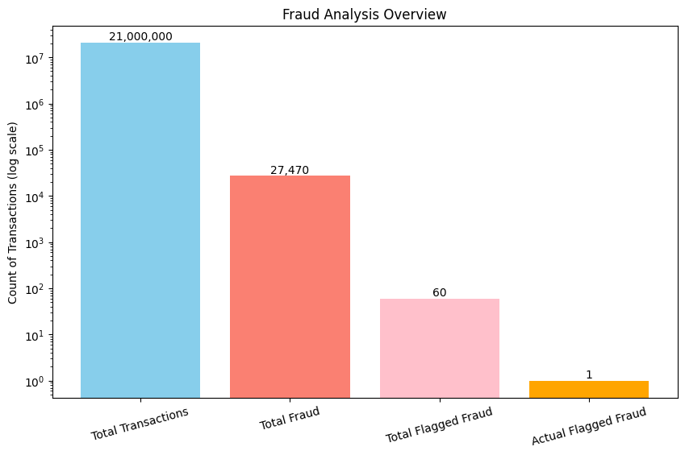
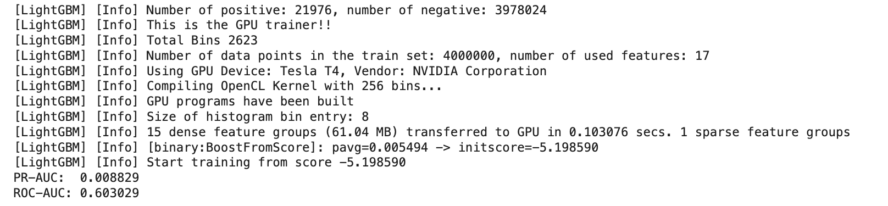
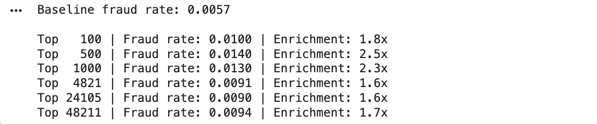
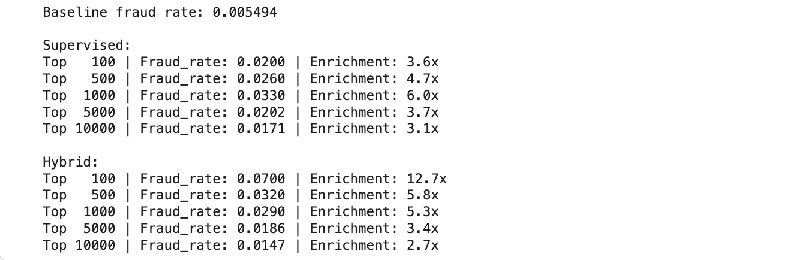

# Hybrid Fraud Risk Prioritisation

## Overview

This repository implements a **hybrid fraud risk prioritisation pipeline** that combines:

- **Supervised transaction-level fraud risk scoring**
- **Unsupervised behavioural anomaly analysis** at the **account × day** level

The project adopts a **ranking-based approach to fraud risk prioritisation**, integrating supervised transaction-level scores with unsupervised behavioural context rather than relying on binary fraud classification.  

This framework is used to analyse how supervised and unsupervised signals interact to support more effective prioritisation of high-risk fraud cases.

---

## Problem Context

Fraud transaction datasets present several practical challenges that influence how models should be designed and evaluated:

- **Extreme label imbalance**, with only a very small fraction of transactions carrying a fraud-related label  
- **Sparse and unreliable fraud flags**, where only a limited subset of transactions are flagged and even fewer correspond to confirmed fraud  
- **Short-lived anomalous behaviour**, where suspicious activity typically occurs in brief time windows rather than as persistent abnormal patterns

Under these conditions, traditional accuracy-based classification is often misleading, as performance is dominated by the overwhelming majority of unflagged transactions.

Accordingly, this project adopts a **ranking-based perspective** that reflects how fraud risk is prioritised and assessed in practical investigation settings.

---

## Dataset

The project uses the **Cifer Fraud Detection Dataset (AF)** from Hugging Face:  
[CiferAI/Cifer-Fraud-Detection-Dataset-AF](https://huggingface.co/datasets/CiferAI/Cifer-Fraud-Detection-Dataset-AF)

The full dataset contains **21 million transactions**, reflecting extreme class imbalance and large-scale transaction behaviour.

Exploratory data analysis is performed on the **full dataset**.  

For modelling, a **stratified 5 million-row sample** is constructed to balance computational feasibility with statistical realism.  
All fraud-labelled transactions are **fully preserved**, while the remaining rows are **randomly sampled from non-fraud transactions** to reach the target size.

This sampling strategy retains all available fraud signal while maintaining representative non-fraud behaviour for supervised and unsupervised modelling.

### Dataset Imbalance

  

Only approximately **0.13%** of transactions in the full dataset are fraudulent, while approximately **99.87%** are legitimate. In addition, only around **0.0003%** of transactions are explicitly flagged as fraud, suggesting that the available fraud flag captures only a very small subset of fraudulent transactions. This motivates a ranking-based approach rather than standard accuracy-based classification.

---

## Notebook Overview

### 01_EDA_Fraud
Explores the full transaction dataset (21M records) to understand **class imbalance**, **fraud flag limitations**, and **transaction behaviour across time, value, and accounts**.

---

### 02_Data_Cleaning_and_Feature_Engineering
Prepares the raw transaction data for modelling through **feature engineering**, **behavioural enrichment**, and **stratified sampling**.

Feature engineering focuses on behavioural and temporal transaction signals, including balance change indicators for origin and destination accounts, transaction timing attributes (hour, day, part of day), transaction value segmentation (amount quantiles), and high-amount transaction flags.

These features support both supervised fraud risk scoring and behavioural anomaly analysis, with feature selection adjusted as appropriate for each modelling approach.

The notebook produces a consistent, reusable **5M-row modelling dataset** with saved **train/test splits**.

---

### 03_Supervised_Fraud_Risk_Scoring
Trains supervised models (Random Forest baseline and LightGBM) to produce **transaction-level fraud risk scores** rather than binary predictions.

Model performance is evaluated in terms of **risk ranking under extreme class imbalance**, using **PR-AUC** as the primary metric and **ROC-AUC** for additional context.  
Performance is further analysed at a **fixed 0.5% alert rate** to assess prioritisation of the highest-risk transactions.

The resulting risk scores form the **baseline ranking** for the subsequent hybrid prioritisation stage.

  

LightGBM performed better than random ranking, but the low PR-AUC and modest ROC-AUC show limited fraud separability using transaction-level features alone. The precision-recall behaviour indicates that only a small number of fraud cases are clearly identifiable before precision drops toward the baseline fraud rate.

---

### 04_Unsupervised_Behaviour_Anomaly_Detection
Applies unsupervised anomaly detection across **three behavioural representations**:
**transaction-level**, **account-level**, and **account × day** aggregation.

The analysis compares how increasing behavioural context affects **anomaly ranking and fraud concentration at top-K cut-offs**.

Transaction-level scoring shows limited prioritisation power, while account-level aggregation improves performance at broader review scopes but fails to surface fraud at the very top of the ranking.
In contrast, the **account × day representation** produces the most actionable results, with fraud strongly concentrated among the highest-ranked behavioural windows.  

These findings indicate that short time-windowed behavioural patterns provide a more effective basis for unsupervised fraud risk prioritisation than either individual transactions or long-term account histories.

The resulting account × day anomaly scores are saved and used as the behavioural input to the final hybrid prioritisation stage.

  

The account × day representation produced the strongest unsupervised results. Fraud was more concentrated among the highest-ranked behavioural windows, suggesting that suspicious activity is better captured through short time-windowed account behaviour than through individual transactions or full account-history aggregation.

---

### 05_Hybrid_Fraud_Prioritisation
Implements the **final decision logic** by combining **supervised transaction-level risk scores** with **account × day behavioural anomaly scores**.

The analysis shows that adding behavioural context reshapes transaction rankings and pushes more flagged fraud events to the top of the investigation list, improving prioritisation under limited review capacity.

  

The hybrid ranking improved prioritisation at the top of the review list. In the Top-100 transactions, the fraud rate increased from **2%** under supervised scoring to **7%** under the hybrid approach, showing that behavioural anomaly context adds useful complementary information for identifying the most critical fraud cases.

---

## Execution Overview

The project is structured as a sequence of notebooks that are executed in order.  
Execution begins with `01_EDA_Fraud.ipynb` and proceeds sequentially through the pipeline, with each stage producing outputs that are reused in later notebooks, as described in the *Notebook Overview* section.

The notebooks support interactive analysis and a consistent, notebook-based execution workflow.

---

## Evaluation Approach

Evaluation is tailored to the modelling approach and the constraints of highly imbalanced fraud data.

**Supervised models** are evaluated based on their ability to **rank transactions by risk**, rather than make binary predictions.  
Performance is assessed using **PR-AUC** as the primary metric, with **ROC-AUC** reported for additional context.  
Results are also examined at a **fixed alert rate (0.5%)**.

**Unsupervised models** are evaluated based on **risk concentration at the top of ranked anomaly lists**.  
Evaluation uses a mix of **fixed cut-offs** (Top-100, Top-500) and **size-based cut-offs** (top **0.1%**, **0.5%**, and **1%** of the dataset), where the alert count scales with dataset size.

Across both approaches, evaluation focuses on **ranking quality and prioritisation effectiveness**, rather than accuracy-based classification metrics.

---

## Key Findings

- The dataset shows extreme imbalance, with fraud representing only approximately **0.13%** of all transactions.
- Transaction-level supervised scoring provides some prioritisation value, but fraud separability remains weak under severe class imbalance.
- Unsupervised transaction-level anomaly detection performed poorly because individual transactions lacked enough behavioural context.
- Account-level aggregation improved broader fraud concentration but diluted short-lived suspicious behaviour.
- Account × day anomaly scoring provided the strongest behavioural representation by capturing short time-windowed fraud patterns.
- The hybrid approach improved the highest-priority ranking results, increasing the Top-100 fraud rate from **2%** to **7%** compared with supervised scoring alone.

---

## Technologies Used

**Environment**
- Google Colab Pro  
- GPU acceleration used for supervised LightGBM training

**Core Language & Data Handling**
- Python  
- pandas, NumPy  

**Machine Learning & Modelling**
- scikit-learn (pipelines, preprocessing, metrics)  
- LightGBM
- Random Forest Classifier
- Isolation Forest

**Data Processing & Utilities**
- Hugging Face `datasets`  
- joblib (model and artefact persistence)

**Visualisation**
- Matplotlib  
- Seaborn  

---

## Scope and Limitations

- Results are **dataset-specific** and are used to compare ranking and prioritisation effectiveness rather than to claim universal performance.
- The work concentrates on modelling, behavioural analysis, and evaluation. Deployment considerations such as real-time inference and monitoring are intentionally not covered.

---

## Key Takeaway

Across the full pipeline, the analysis highlights that combining supervised transaction-level risk scoring with unsupervised behavioural context provides a more informative basis for fraud prioritisation than transaction-level classification alone, particularly in settings with sparse labels and short-lived fraud behaviour.

